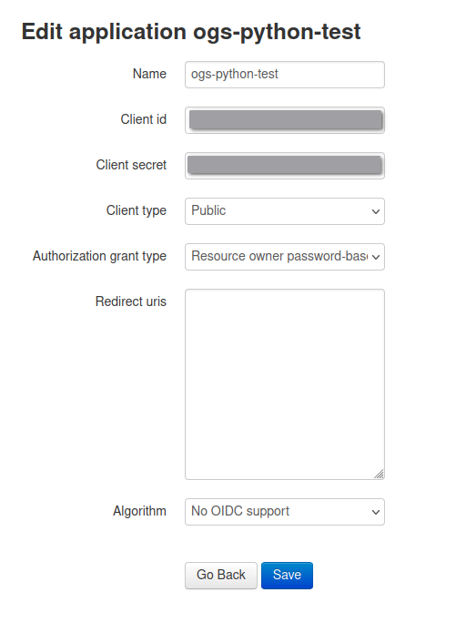

# How To Use This Module

## What you'll need

- Python 3.7+
- A client ID and secret from OGS
  - This can be created at [https://online-go.com/oauth2/applications/](https://online-go.com/oauth2/applications/) using the below parameters



## Installation

Installation is easy enough, simply install the PyPI package:

```bash
python3 -m pip install ogsapi
```

## Connect to the REST API

Now, we can import the module and create an instance of the OGSClient class:

```python
from ogsapi.client import OGSClient

ogs = OGSClient('your_client_id', 'your_client_secret', 'your_username', 'your_password')
```
If you want debug logs, you can pass `log_level='DEBUG'` to the constructor. This will authenticate you to OGS using your API credentials, but does not connect to the Realtime API.

From here, you should be able to call of the REST API related methods.

## Connect to the Realtime API

First, we need to create two callback functions that will be used as event handlers for the socket. These are called when the socket receives an event from the API. One will be for general events from the socket, and the other will be specific to game events. You can use the same for both, just dont pass the callback_handler argument when connecting to a game.

```python
def ogs_error_handler(data: dict):
  print(f"OGS Error from API: {data}")

def ogs_notification_handler(data: dict):
  print(f"OGS Notification from API: {data}")
```

These functions are important as they will be sent the event data when we get it from the socket. The OGSGame class handles updating some of its data from these events itself. Currently, its up to you to handle the rest of the events, I intend to make this easier in the future. But there is a large list of events to handle. You can see all valid events [here](https://docs.online-go.com/goban/modules/protocol.html).

From here, we can connect to the socket, passing it the ogs_error_handler function, then we can connect to a game.

```python
ogs.socket_connect(ogs_error_handler)
game_id = 12345678
game = ogs.sock.game_connect(game_id, ogs_notification_handler)
```

We should now be connected to the Websocket, and connected to the game. We can now interact with the game using the OGSGame class. We can also interact with the socket using the OGSSocket class. See the [OGSSocket](/api/#src.ogsapi.ogssocket.OGSSocket) and [OGSGame](/api/#src.ogsapi.ogsgame.OGSGame) classes for more information.

## Disconnecting from the Realtime API

When we are done with the realtime API, we can disconnect using [disconnect_socket()](/api/#src.ogsapi.client.OGSClient.disconnect_socket). This will properly disconnect from the socket. Not doing this will require you to quit out of the program using a keyboard interrupt.

!!! warning

    It is your responsibility to disconnect from the socket when you are done with it. Not doing so will cause the program to hang when you try to quit. This is because the socket is running in a separate thread, and the program will not quit until all threads are finished.

## Usage

### Basic Usage

Now that we are setup, we can start using the API. The API is split into two parts, the REST API and the Realtime API. The REST API is used for all non-realtime requests, and the Realtime API is used for all realtime requests. Lets get some basic data from the REST API. Not everything is fully Pythonic as of yet, so some methods return the full JSON message received from the API, and some parse out the important info and returns the relevant info. I wont cover everything here, but you can find the full documentation [here](/api/) to see what method does what.

[user_vitals()](/api/#src.ogsapi.client.OGSClient.user_vitals) grabs the users vital information:

```python
ogs.user_vitals()
```
Gets:
```json
{
  'id': 1010740, 
  'username': 'Bone-A Lisa', 
  'ratings': {}, 
  'ranking': 14.213709402750553, 
  'about': '<a rel="me" href="https://noc.social/@diobolic"></a>', 
...
}
```

To get information on a player, you can use [get_player()](/api/#src.ogsapi.client.OGSClient.get_player)]:

```python
ogs.get_player('Bone-A Lisa') # (1)
```

1. The username is case sensitive.

If you want to create a challenge, you can use the [create_challenge()](/api/#src.ogsapi.client.OGSClient.create_challenge) method to create either an open or direct challenge. Here is an example of creating a direct challenge:

```python
ogs.create_challenge(player_username="Bone-A Lisa", 
  ruleset="japanese", 
  time_control="fischer", # (1)
  fisher_time_initial_time=300, 
  fischer_time_increment=0, 
  ranked=True, 
  handicap=0, 
  komi=6.5, 
  width=19, 
  height=19
)
```

1. Selecting the time control will automatically set the time control parameters. For example, if you select `fischer`, the `main_time` and `increment` parameters will be used. If you select `byoyomi`, the `period_time` and `periods` parameters will be used.

```bash
Challenging player: Bone-A Lisa - 1010740
(20328495, 53331333)
```

This gives us back the challenge ID and the game ID. The challenge ID is used to accept the challenge, and the game ID is used to get the game information.

To list our incoming challenges, we can use the [received_challenges()](/api/#src.ogsapi.client.OGSClient.received_challenges) method:

```python
ogs.receive_challenges()
```

### The Realtime API

The Realtime API is used for all realtime requests. This includes things like chat, connecting to games, and receiving notifications.

#### Game Class

The most prominent method in the Socket class is connecting to games. This can be done using the [sock.game_connect()](/api/#src.ogsapi.ogssocket.OGSSocket.game_connect) method. This returns an [OGSGame](/api/#src.ogsapi.ogsgame.OGSGame) object, which contains all the SocketIO functions used to interact with the game. 


This can be a little complicated when you want to be able to connect to multiple games at once, So lets create an example class that contains all of our callback functions, as well as any game functions we want to pass to the Socket, and instantiate it:

```python
class Game:
  def __init__(self, game_id: int, ogs: Callable):
    self.game_id = game_id
    self.ogs = ogs
    # Connect to the game, passing the event handler
    self.connect(callback_handler=self.event_handler)

  def connect(self, callback_handler: Callable):
    self.ogs.sock.game_connect(self.game_id, callback_handler)

  def event_handler(self, event_name: str, data: dict):
    # Here we would do the processing of the events
    print(f"Got Event: {event_name} with data: {data}") 

  def move(self, move: str):
    self.game.move(move)

  def pass_turn(self):
    self.game.pass_turn()

game = Game(game_id, ogs)
```

Now, whenever we receive move, undo, or phase change events, we will be able to handle them via the methods in the class. We can also use the methods in the class to interact with the game. For example, we can make a move using the `move()` method. We can also pass our turn using the `pass_turn()` method.

```python
game.move('A1') # (1)
```

1. This accepts GTP coordinates and double character coordinates ('aa').

```python
game.pass_turn()
```

There are other methods that can be used to interact with the game, which can be found in the [OGSGame](/api/#src.ogsapi.ogsgame.OGSGame) class. The game class also stores quite a bit of data about the game, which can be accessed via the class. For example, we can access the game clock using `game.clock`, or the game phase using `game.phase`, both are viewable from the `OGSGame` attributes.

#### Socket level methods

The [OGSSocket](/api/#src.ogsapi.ogssocket.OGSSocket) class also has some methods that can be used to interact with the Socket. These are mainly for conencting and disconnecting to games. But we can also grab the `host_info()` of the host we are connected to, if desired. Or we can `ping()` the server to see if we are still connected.

```python
ogs.sock.host_info()
```

```python
ogs.sock.ping()
```

See the [OGSSocket](/api/#src.ogsapi.ogssocket.OGSSocket) class for more information.


